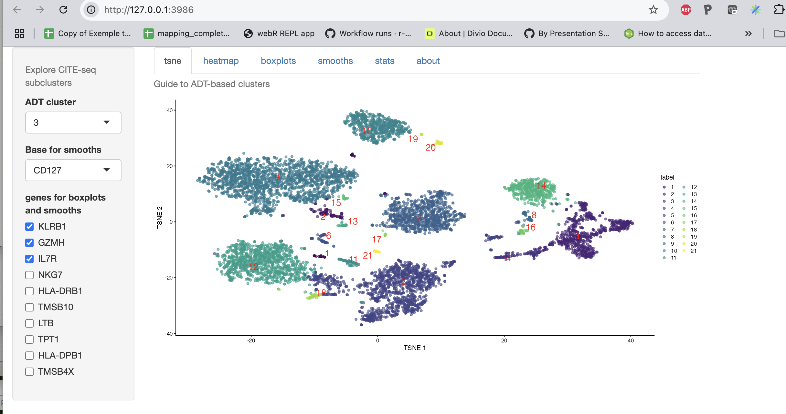
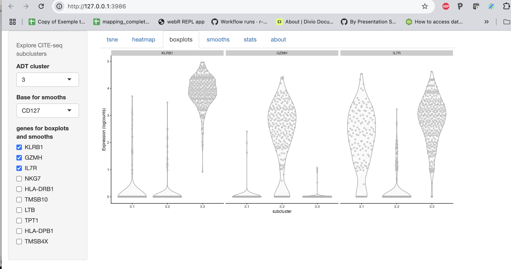

# scviR

The scviR package provides an
experimental interface between R and [scvi-tools](https://docs.scvi-tools.org/en/stable/).

For Bioconductor 3.22, extensive changes have been made.

We include an app that helps explore subclusters formed using
expression data within clusters formed by abundance patterns
of antibody-dependent tags.

A basic concern is identification of subclusters identified
by 'boolean' expression patterns of specific genes.

